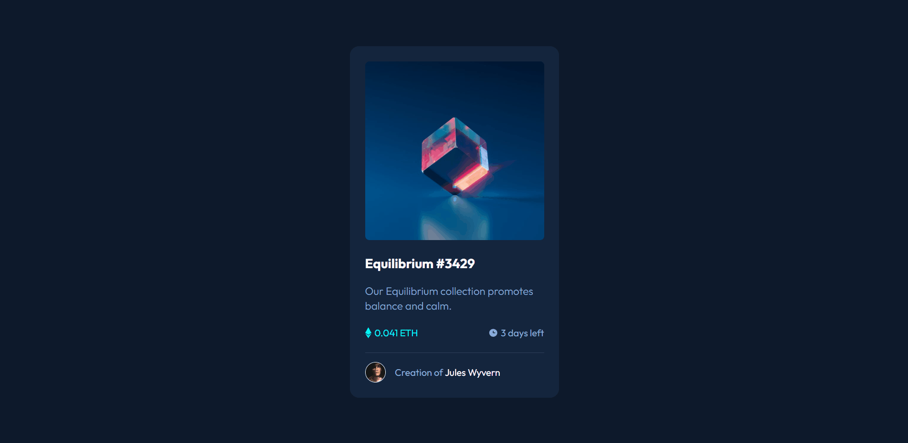
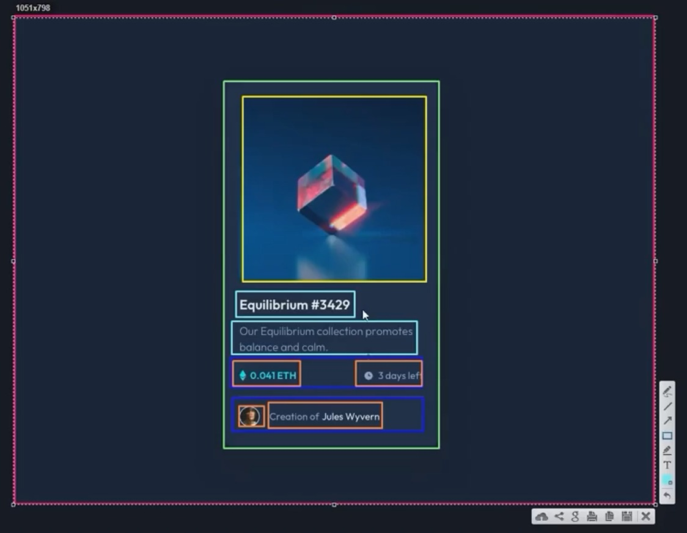

# Workshop DevQuest - Projeto NFT Preview Card Component

## __Sumário__
- [Apresentação](#apresentação)
- [Explicação do Projeto](#explicação-do-projeto)
- [Gif e URL da Página](#gif-e-url-da-página)
- [Ferramentas e Tecnologias Utilizadas](#ferramentas-e-tecnologias-utilizadas)
- [Principais Aprendizados do Workshop](#principais-aprendizados-do-workshop)
- [Desenvolvimento Contínuo](#desenvolvimento-contínuo)
- [Agradecimentos e Conclusão](#agradecimentos-e-conclusão)

## __Apresentação__ 

Olá, sou Miguel, um aspirante a Desenvolvedor Web, e este projeto faz parte da minha jornada no curso de Formação de Desenvolvedor Web Fullstack _(DevQuest - Dev em Dobro)_. Este layout não foi recriado por mim sozinho, nem faz parte de um desafio ou exercício prático. Na verdade, sua codificação foi conduzida integralmente pelo professor Beto durante o Workshop __*"Como Criar um Projeto do Zero sem Travar"*__, parte integrante do módulo __*"Reforço CSS3"*__ do curso.

Costumo utilizar meus README's como diários técnicos para documentar o processo de desenvolvimento de um projeto. No entanto, este será um pouco diferente: __meu foco aqui será compartilhar os aprendizados adquiridos durante o Workshop.__ A proposta desse aulão especial foi ensinar técnicas práticas para recriar ou desenvolver interfaces web de forma eficiente e sem "travar". Ao acompanhar o professor Beto — um profissional altamente qualificado e experiente — desenvolvendo a estrutura e o código da interface, obtive insights valiosos que certamente serão aplicados nos meus projetos futuros.

## __Explicação do Projeto__
Este projeto consiste em um __layout de cartão__, desenvolvido utilizando _HTML_ e _CSS3_. Para a construção desta interface, foram aplicados conceitos importantes, como __*CSS Flexbox*__, __*CSS Grid*__, __posicionamento com  *Position*__, __uso de *Pseudo-elementos*__ e __*Variáveis CSS*__.

### O cartão apresenta um design simples, com os seguintes elementos:

1. __Imagem em destaque:__ Uma ilustração que ocupa o topo do cartão e é centralizada horizontalmente.  
__Nota:__ A imagem possui um efeito interativo aplicado com a pseudo-classe `:hover`. Ao passar o mouse sobre ela, é exibida uma sobreposição com fundo na cor `--primary-medium`  (verde-água fluorescente) e opacidade de 0.4, juntamente com um ícone de "olho" centralizado, simbolizando a visualização.

2. __Título do NFT:__ Um texto em negrito (_Equilibrium #3429_) que se destaca como título principal.  
__Nota:__ O título apresenta um efeito `:hover` que, ao passar o mouse, altera a cor do texto para `--primary-medium` (verde-água fluorescente).

3. __Descrição:__ Uma breve descrição.

4. __Informações adicionais:__  

    - __Valor em ETH:__ Exibido em cor verde-água fluorescente, destacando-se
 visualmente.
    - __Tempo restante:__ Informado com um ícone de relógio, seguido de _"3 days left"_.

5. __Linha divisória:__ Uma linha sutil separa o conteúdo principal das informações do criador (criada via propriedade `border-top`).

6. __Seção do criador:__ Exibe um avatar circular, seguido pelo texto "_Creation of_" com destaque para o nome _Jules Wyvern_ [Este nome possui um estilo interativo com a pseudo-classe `:hover`. Quando o mouse passa sobre o texto, a cor é alterada para `--primary-medium` (verde-água fluorescente).]

Além disso, o projeto precisa ser responsivo, garantindo que o cartão se ajuste adequadamente a diferentes tamanhos de tela, mantendo sua estrutura e proporções.

 ## __Gif e URL da Página__
   

  

### [GitHub Pages](https://miguel-dalmeida.github.io/nft-preview-card-component-project/) 

## __Ferramentas e Tecnologias Utilizadas__

 
  
  
  

### __Principais Recursos e Abordagens__
- Div's estilizatórias em __*HTML*__;
- Uso de __*Variáveis CSS*__ para maior consistência e reutilização de estilos;  
- Aplicação de __*Flexbox*__ e __*Grid CSS*__ para estrutura;  
- Propriedades personalizadas do __*CSS3*__;  
- Metodologia de desenvolvimento __*Desktop-First*__;
- Uso da extensão __*Awesome Screenshot & Screen Recorder*__ para capturar e planejar visualmente a estrutura do projeto antes da codificação; 
- Extensão __*PerfectPixel*__ para comparar em tempo real o resultado do meu código com o design original e garantir o alinhamento preciso dos elementos; e
- Outros conceitos e ferramentas. 

Veja na prática como foram utilizadas as extensões **Awesome Screenshot & Screen Recorder** e **PerfectPixel**.

### _Awesome Screenshot & Screen Recorder:_  

  

Na imagem, é possível observar as divisões feitas no design do projeto. No Workshop, o professor Beto destacou a importância de realizar essa análise estrutural antes de iniciar o código. Ele explicou que, ao planejarmos as seções e refletirmos sobre a estrutura _HTML_ e sua resposta no _CSS_, diminuímos as chances de travar durante a codificação. Com esse aprendizado, passarei a usar essa extensão sempre para planejar minha estrutura antes de codar.
  
### _PerfectPixel:_

A extensão PerfectPixel foi utilizada para facilitar a estilização do layout, especialmente no que diz respeito às medidas. No caso do Frontend Mentor, por exemplo, os desafios disponibilizam apenas imagens do design, e o acesso ao arquivo no Figma é restrito ao plano Pro (pago). Isso significa que não temos acesso direto às especificações de espaçamentos, tamanhos de elementos e fontes.

Essa extensão resolve esse problema ao permitir que carreguemos a imagem do layout e ajustemos sua opacidade. Dessa forma, conseguimos sobrepor o design original ao nosso código, facilitando a comparação visual. Esse recurso simplifica o processo de ajuste das medidas e alinhamento dos elementos, reduzindo o tempo gasto e os desafios para garantir que o código esteja fiel ao design proposto.

## __Principais Aprendizados do Workshop__
Durante o workshop, obtive diversos aprendizados técnicos e práticos que contribuirão significativamente para o meu desenvolvimento como desenvolvedor. Abaixo, destaco os __10 principais aprendizados__ adquiridos:

### __Novos Conceitos e Boas Práticas__
1. __Organização Pré-Codificação__  
  Aprendi a organizar e ordenar minhas tarefas antes de iniciar a codificação, facilitando o planejamento e execução do projeto.

2. __Meta Tag `<meta name="description" content="">`__  
  Compreendi como usar essa _tag_ para fornecer uma breve descrição do conteúdo da página, melhorando a indexação nos mecanismos de busca e exibindo snippets nos resultados de pesquisa (_SEO_).

3. __Arquivos do Frontend Mentor__  
  Obtenção de conhecimento técnico sobre os arquivos disponibilizados pelo Frontend Mentor, o que me ajudará nos próximos desafios deste site.

4. __Estruturação com div__  
  Utilização estratégica de `div`'s para facilitar a estilização, com foco no posicionamento de elementos.

5. __Boas Práticas de Codificação__  
  Obtive diversas dicas que melhorarão significamente meu código, como por exemplo: "estilizar o _CSS_ seguindo a ordem do _HTML_ para garantir um código mais organizado, coeso e legível".

6. __Responsividade com `padding`__  
  Correção de problemas de responsividade utilizando a propriedade `padding` para ajustar elementos em diferentes telas.

7. __Ordem Correta dos Links *CSS*__  
  Entendimento da importância de seguir a ordem adequada dos links _CSS_ no _HTML_, garantindo o correto carregamento dos estilos.

8. __Estilização de Estados Ativos (*Active States*)__  
  Técnicas específicas para implementar o estado ativo de elementos no projeto.

9. __Propriedade `transition`__  
  Estudo completo da propriedade `transition`, que permite criar animações suaves e transições visuais no _CSS_.

10. __Hierarquia com `::before` e `::after`__  
Entendimento da hierarquia ao adicionar elementos via _CSS_. 

### Revisão de Conceitos Importantes

Além dos novos aprendizados, tive a oportunidade de revisar e reforçar conceitos fundamentais, como:

- __Pseudo-elementos:__ `::before` e `::after`;
- __Estilização de Fundos:__ Propriedades relacionadas a `background` no _CSS_;
- __Propriedade `position`:__ Uso de `static`, `relative` e `absolute`; e
- __Valores Padrão no *Flexbox*:__ Revisão dos valores padrões das propriedades do _Flex_.

### Acesse abaixo a página do Notion com as anotações dos aprendizados obtidos neste Workshop:
[__Notion - Anotações do Módulo de Reforço CSS3__](https://gigantic-chef-a6f.notion.site/M-dulo-de-refor-o-CSS3-152cd10b93ab806388e4ef17dc343dd6)

## __Desenvolvimento Contínuo__
Após concluir este workshop, darei continuidade ao módulo de reforço _CSS3_, com o próximo aulão intitulado: "__*Quando Eu Uso Divs!? Aprenda a Criar um HTML que Não Vai Dar Dor de Cabeça*__". Esse conteúdo abordará práticas para estruturar _HTML_ de forma eficiente, evitando problemas futuros durante a estilização. 
Com a finalização deste aulão, avançarei para o próximo módulo, "__*Projeto Landing Page com Grid e Flex*__", que conta com um total de 8 aulas. Esse módulo tem como objetivo ensinar, de forma teórica e prática, o desenvolvimento de uma _landing page_ completa utilizando as ferramentas __Grid__ e __Flexbox__.

## __Agradecimentos e Conclusão__

Agradeço por dedicar seu tempo para explorar este projeto e acompanhar minha jornada por meio deste diário técnico. Acredito que os conhecimentos adquiridos durante este workshop foram fundamentais para o meu crescimento como desenvolvedor, e já sinto que evoluí significativamente com as técnicas e conceitos aprendidos.

Essas novas habilidades serão aplicadas em meus futuros projetos, facilitando o desenvolvimento dos mesmos. Ainda há muito a descobrir e aperfeiçoar, mas cada etapa concluída me aproxima do meu objetivo de alcançar a excelência no desenvolvimento web.

  

    
    
  

  

